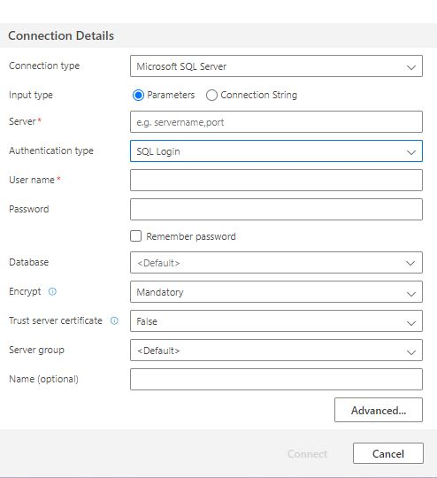
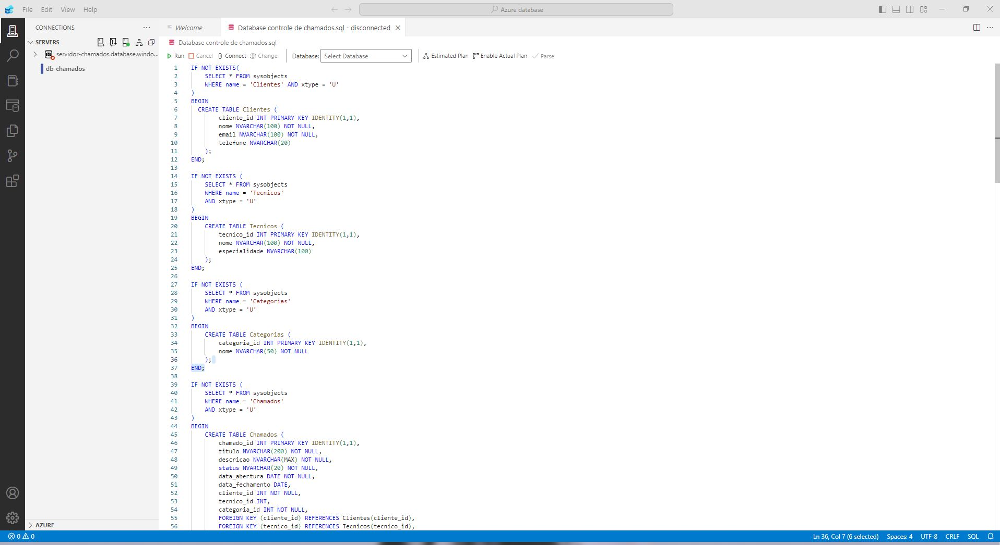

#  - Administrador de banco de dados Azure

# Sistema de Controle de Chamados - Banco de Dados SQL (Azure)

Este projeto é um sistema de controle de bchamados de TI desenvolvido e hospedado no **Azure SQL Database**, com foco em problemas comuns enfrentados por empresas no dia a dia, como:

-  Computador lento  
-  Problemas de rede  
-  Falhas de software ou hardware  
-  Problemas de acesso e segurança

## Plataforma

O banco de dados foi totalmente desenvolvido na nuvem, utilizando os recursos da plataforma **Microsoft Azure**, permitindo escalabilidade, segurança e fácil gerenciamento.

## Sobre o Projeto

O sistema foi construído com:

- Tabelas relacionais normalizadas  
- Dados simulados com `INSERT`  
- Consultas SQL com `JOIN` para geração de relatórios  
- Testes no ambiente da **Azure Data Studio**

## Estrutura Principal

As principais tabelas incluem:

- `usuarios` – pessoas que abrem chamados  
- `chamados` – solicitações de suporte técnico  
- `categorias` – tipo do problema (ex: rede, hardware, software)  
- `tecnicos` – responsáveis por atender os chamados

## Objetivo do Projeto

Este projeto foi criado com fins **educacionais e demonstrativos**, com foco em:

- Aprender modelagem de banco de dados  
- Usar recursos do Azure SQL na prática  
- Praticar consultas SQL com múltiplas tabelas  
- Simular um cenário corporativo real

## Tecnologias utilizadas

- SQL  
- Azure SQL Database  
- Azure Data Studio  

## Demonstrações

### interface de conexão do banco (login/senha)

### Área de desenvolvimento

### Código SQL
[Modelo fisico do banco de dados](./db-controle-de-chamados.sql)

## 👨‍💻 Autor

Feito com dedicação por **Felipe da Silva**  
📫 Instagram: [@Sk_felps](https://instagram.com/sk_felps)

---
